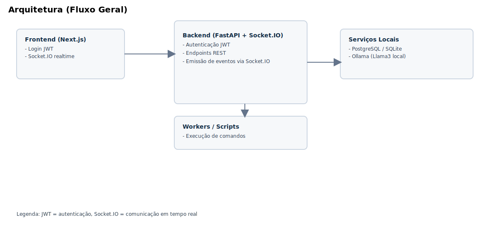
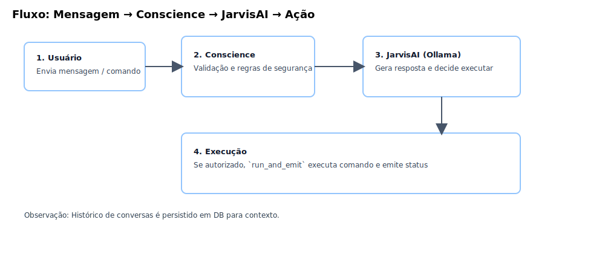
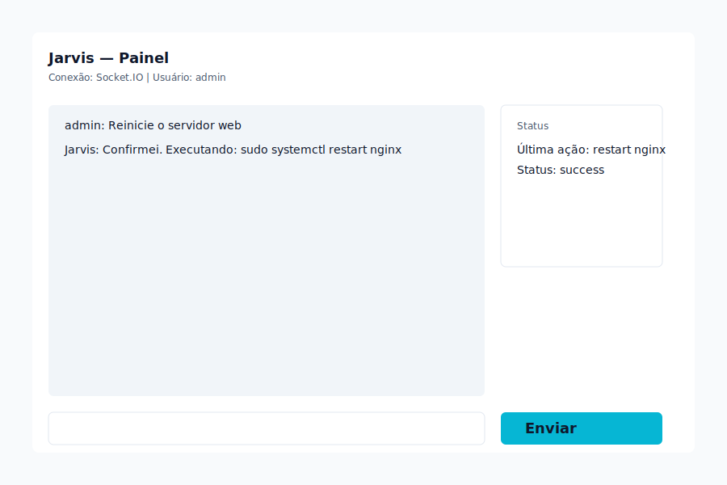

<!-------------------------------------------------
 Copy of root Checklist.md placed under docs/ for viewer
--------------------------------------------------->

# Checklist do Jarvis — Recursos e Status

Este documento lista as funcionalidades esperadas de um assistente "Jarvis" completo, o que já implementamos neste repositório e o que ainda falta para chegarmos a um Jarvis operacional.

Diagramas rápidos

UI (mockup):

Sumário rápido
- O que temos (implementado / parcial): backend FastAPI + Socket.IO com JWT no `connect`, endpoint `/api/execute` com JWT obrigatório + policy/allowlist, instalador inteligente (`scripts/installer.sh`), CLI (`cli.sh`) incluindo `fx-on/fx-off`, scaffold web Next.js com login JWT e efeito visual de atividade, testes automatizados básicos (`pytest`), unit file `systemd`, scripts utilitários e documentação (`README.md`, `INSTALL.md`).
- O que falta (principais itens): integração IA local completa (Ollama), STT/TTS funcional, persistência avançada (migrations/Alembic + Redis real), segurança de produção (HTTPS/rate limit/refresh token), auditoria aprofundada e controles avançados de hardware.

... (manter conteúdo do Checklist principal)
# Checklist do Jarvis — Recursos e Status (docs)

Versão resumida do `Checklist.md` para a documentação do projeto.

Principais pontos
- Backend: `FastAPI` + `Socket.IO` com validação JWT no `connect`.
- Execução: `POST /api/execute` protegido por JWT e `conscience` + allowlist.
- Frontend: scaffold Next.js com login JWT e painel básico.

O que falta
- Integração Ollama completa e STT/TTS.
- Persistência avançada com migrations (Alembic) e Redis.
- Segurança de produção (HTTPS, rate limiting, refresh tokens).

Checklist rápido

- [x] Backend básico e endpoints principais
- [x] Instalador inteligente e CLI
- [x] Efeito visual local (`fx-on` / `fx-off`)
- [ ] Migrations/Alembic aplicadas
- [ ] Dockerfile e CI

Consulte o `Checklist.md` raiz para detalhamento técnico.
